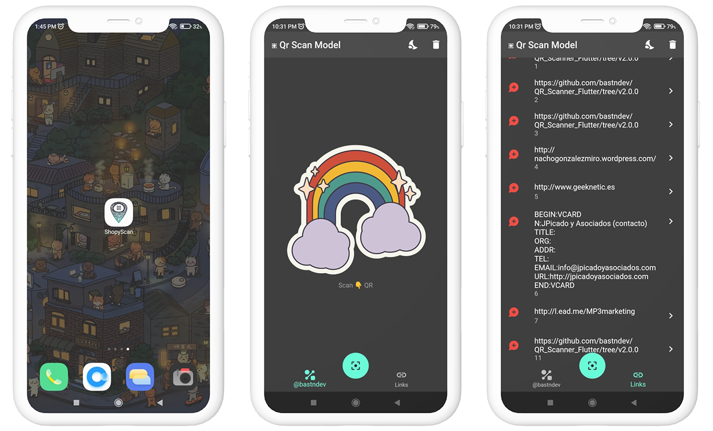
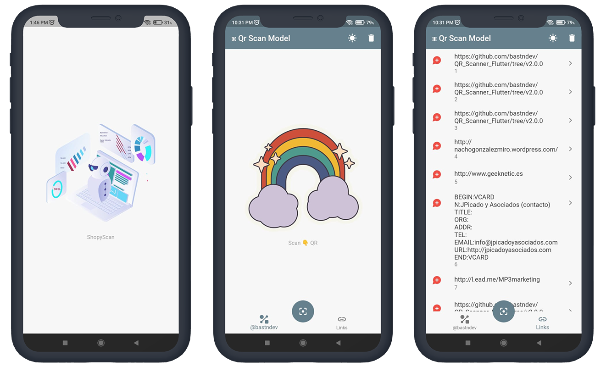

<!-- logo IMG -->
<p align="center">
    
  </a>
</p>

<!-- Title -->
<h1 align="center"> ShopyScan </h1>

<!-- Version - Social Media - ect -->
<div align="center">
<!-- CI -->
  <a href="https://github.com/bastndev/ShopyScan/actions/new">
   
  </a>
<!-- Version -->  
  </a href="#">
     
  </a>
<!-- Version Android -->
  <a href="#">
    
  </a>
<!-- Version iOS -->
  <a href="#">
    
  </a> 
<!-- Twitter -->
  <a href="https://twitter.com/bastndev" target="_blank">
    
  </a>
</div>

<!-- Info -->
> With this app you can scan and [awesome website](https://example.com)  maps ect what differentiates it from the others is the elegance pe papi.

>- Dark Mode

  <div>
    
  </div>

>- Light Mode

  <div>
    
  </div>


## Dependence
>use this is dependencies for ejectum this is apk thank so much for visit this is site 

```.dart
  provider: ^6.0.5
  flutter_barcode_scanner: ^2.0.0
  path_provider: ^2.0.15
  sqflite: ^2.2.8+4
  url_launcher: ^6.1.11
  google_maps_flutter: ^2.3.0
  lottie: ^2.4.0
```

