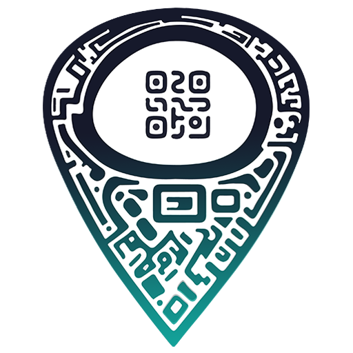

<!-- logo IMG -->

    
  </a>

<!-- Title -->
<h1 align="center"> ShopyScan 🎯</h1>

<!-- Version - Social Media - ect -->

  
<!-- Version -->  
  </a href="#">
     
  </a>
<!-- Version Android -->
  
<!-- Version iOS -->
   
<!-- Twitter -->
 

<!-- Info -->
> With this app you can scan and url maps ect what differentiates it from the others is the elegance pe papi.

## Working :taco: 👷 ``:taco:``

:alien: ``:alien:``

:apple: ``:apple:``

:recycle: ``:recycle:``

:speech_balloon: ``:speech_balloon:``

:brain: ``:brain: ``

:octocat:  ``:octocat: ``

<!-- add to Tag --> 
<!-- Focus WTF -->